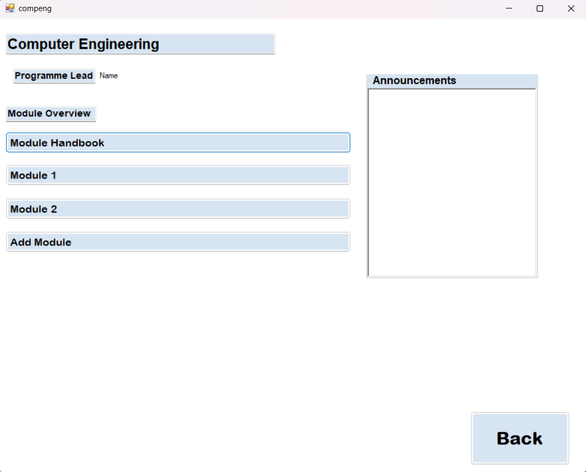
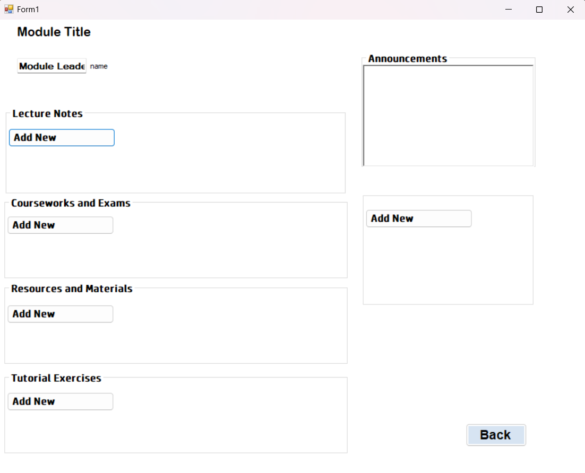

# **Phase 3 - Implementation and Testing**

## **1. Table**
---

|Name|Git Username|Gre Username|Tasks|
|-----|---|-----|---|
|Nirmal Philips Tom|nirmalphilips2003|nt1217s@gre.ac.uk|Course & Module Section|
|Harishanan Thevarjah|Harishanan|ht7998v@gre.ac.uk|Home Page, Fees Page, Time Table and Student Profile|
|Karim Borgi|kb9488|kb3825c@gre.ac.uk|Login & OTP Page, Login Database|
|Nandana Krishna|nk1121|nk1640r@gre.ac.uk|Attendance Page, Other Database's|

## **2. Introduction**
---
In the third phase of our project, we focused on implementing and testing the second phase of the student management system. Our team used the C# programming language to design the user interface, and we created various forms for different tasks such as login, OTP verification, creating accounts, home page, fees, attendance, timetable, courses, and student records. We created separate databases for each form, and the textboxes on the forms retrieved data from these databases and executed processes according to instructions. After creating forms in different branches, we merged them together into the test branch on GitHub. To ensure the proper connections between the databases and the windows forms, we conducted various tests. The test branch was pushed into the when testing was completed.

## **3. Implementation**
---

The Student Management System system consists of several pages including a login page, OTP page, home page, course page, attendance page, timetable page, fees page, and student profile page. The implementation of each of these pages is discussed below: 

**We have created a login interface with 3 forms:** 

- Login 
- Create account
- OTP form

The login prompt will ask the user to input their usernames and password, this will be validated using data from a windows access database. If the login details are correct, the user will then go to an  otp form, which in theory should send the user to receive an otp in their email and if they input the correct one, then the login process succeeds, and the user proceeds to the login page.
In case the user has no account, they can press the create account button, this will allow them to insert their details which will be pushed forward to the access database.

### **3.1 Login Page**
---
The login page comprises of 2 labels, 2 textboxes, and 2 buttons

The labels are used to hint for the user to know where they can input the required fields

The textboxes are:

- Username
- Password

There are where the users can input their details.

The buttons are:

- Login
- Create Account

The login button will redirect user to the OTP page for further verification, while the create account button will redirect users to create their new account

The Validation code:

Figure 1: Code for log in page  
The code above is able to validate the inputted username and password from the Microsoft access database, checking the strings and using a counter to make sure input is the same as the pre-existing data.

**New Account**

This form comprises of 6 labels,6 textboxes,  as well as one button. These textboxes and labels will prompt users to input the required fields and allow for the user to input them. The dropdown menu is used to allow users to select their course which is linked to the database. Pressing on the create button will guide users back to the login page.

**OTP Page**

This form just comprises of a label, a textbox, and 1 button. These will prompt the user to input their OTP into the textbox as a form of extra validation. The login button will guide the user to proceed to the home screen.

### **3.2 Home page class** 
---
  
Figure 2: Home page of student management system
 

This is the page which appears after the log in page. The home page gives navigation for the students to the course, timetable, attendance, fees and student profile pages. The home page contains 5 buttons and 1 label as shown in the figure 2. The label displays the learning portal as introduction to the students. Then, to navigate for each pages the buttons will help. If a student clicks a specific button, it will change page into selected choice. For example, if a student wants to look his timetable, has to press the timetable button and it opens the timetable. To give users some attractive or convey information more efficiently, an image has placed into the buttons. If student wants to logout from the system, has to press the logout button.  
Now moving into the programme discussion, this page is created under the class name Home. It made as public which gives access to the class everywhere.  Inside the home 5 methods have been included doing the same functions. As shown in the figure 3, for the timetable button a click function has been fereated for the relevant classes, hides the current form of home and displays the created instances. Moreover, the click functions give users to use keyboard(space /enter button) or mouse to do the tapping /clicking option.

  
Figure 3: Timetable button function  

 ### **3.3 Course Page**
 ---
 The course page takes the user to their corresponding course page. We created course page's for four different courses.

Figure 4:Course page in student management system
 

It contains following elements/options:

- **Course Details** - Course information including Course name and Course leader name.

- **Announcements** - Option to add announcements regarding course.

- **Course Handbook** - Users can view the course handbook.

- **Module Button** - Users can go to the corresponding module page by clicking module button.

### **3.4 Module Page** 
---
The Module page takes the user to their corresponding module page. We created two modules each for every courses for an demo.

Figure 5:Module page in student management system

It contains following elements/options:

- **Module Details** - Course information including Module name and Module leader name, etc...

- **Lecture Notes** - Users can view Lecture notes.

- **Courseworks & Exams** - Users can view information regarding coursework, exams etc...

- **Resources & Materials** - Users can go to the corresponding module page by clicking module button.

However, We made some basic format of a Course page and Module Page, The admin users will be able to make changes as their needs.

### **3.5 Timetable page class** 
---

  
Figure 6: Fees page of student management system  
 
This page appears when the user clicks the timetable button in the home page. The timetable page is designed to provide timetable information for students. This page contains a data grid view, text box, two labels, two buttons and a date time picker. The labels used to print information to the screen such as the “Timehead_label” and “Holiday_label”. The data grid view used to print the timetable for the student from the Microsoft Access database as shown in the figure 6. The timetable will be displayed when the user presses the “Show Timetable” button. The holiday_textBox will display holiday information. The “Back” button returns the page to home.  
As moving to the coding part, this page is displayed from the Timetable class. It connects with the timetable database. The connection is made using the OLEDBConnection class. The database is made in Microsoft Access database 2016 in 64 bits. Therefore, the provider is assigened with Microsoft.ACE.OLEDB.16.0. Then, as mentioned earlier if user presses the “Show Button” the timetable will de displayed. The coding is shown in the below figure 7. It used the try and catch statement. If the connection succeeds with opening database, by using qyuery variable. The query variable takes the reading of specified columns from the database and displays it using the command object. If the connection fails a failure notification message will appear in the “time_dataGridView” using the catch statement.  
  
Figure 7: Coding for Show button click displaying timetable  
 

### **3.6 Attendance page class** 
---  

  
Figure 8: Attendance page of student management system  
 
As shown in the figure 8, the attendance page will appear when user taps the attendance button in the home page. This page contains a label, two buttons and data grid view. The "Attendancehead_label" provide information about the page. The show_btn2 give access to view the student's attendance in the below timegrid.  
As moving into the coding part, this page is designed under the Attendance class. As shown in the below figure 9, in the show_btn2_click method, a OLDEB connection class is made. It connects with the Attendance database in the local system using the Microsoft.ACE.OLEDB.16 provider. Then, to the attendance_datagridview the attendance details will be fetched. The code is shown below in the figure 6.  

Figure 9. Coding for Show button click displaying attendance  
 

### **3.7 Fees page class** 
---  
  
Figure 10: Fees page of student management system  

This page appears when the user clicks the fees button in the home page. This page gives information about the total fees, fees paid and fees need to pay. This page contains 4 labels, 3 text boxes and 2 buttons. The labels provide information to the fees page as shown in the figure 10. The text boxes show the values for the relevant information. The proceed_button takes the user to the banking page where the transaction happens for the online university organistaion. The back button takes the user back to the home page.  
Discussing the coding structure, the fees class is made as public to use/call wherever in the programming structure. The page is connected with the Microsoft access database using the OleDbConnection class. The text box values are connected with database. If user taps the back button, using the code shown in figure 11 the page will change into home page by assigning the “homeform” variable with the “Home()” method.  

  
Figure 11:Back button in the Fees page  
 

### **3.8 Student profile page class** 
---  

Figure 12: Student profile page in Student Management System  

This page appears when user taps the student profile button in the home page. It provides the details of the student. This page contains labels, textboxes, two buttons and a picture box. The labels provide information for the page. The text boxes assign values for the information. The picture box displays the image of student from the data base. The back button lets the user to return home page.
Moving to the coding part, this page contains in the student profile class. It is a public class. This page will connect with the database of the students and provide the relevant values for the text boxes for the specific students.However, under some circumstance of connecting data base connection a failure occurred.

## **4. Testing**
---
To ensure the system works as intended, several tests were conducted during and after the development process. 

The testing involved the following steps:

- **Unit Testing** - We performed unit testing on each sections to ensure that they are working as expected. 

- **Integration & System Testing** - We performed integration testing on the entire system after merging to ensure that all the systems are working together seamlessly. 

- **Regression Testing** - The system was tested after any changes or updates were made to ensure that the existing functionality was not affected.

The testing process helped to identify and fix any bugs or errors in the system, ensuring that it works smoothly and meets the requirements of the users.

## **5. Conclusion**
---
The user interface for our project were created using the C#. We created various forms for different functionalities. After developing the forms, we integrated them into the test branch. Nevertheless, we encountered obstacles when we tried to link the forms to the MS Access database. We attempted to remedy the situation by creating separate databases for each form within a branch that contained the source data file. However, even after pushing this branch to the test branch, we still encountered some issues.
Despite the difficulties we faced during this project, we were able to gain valuable insights into designing and coding Windows forms. We also deepened our understanding of the MS Access data file. As we move forward, we hope to continue working on similar project to make it a success, drawing upon our newfound knowledge and experience. 