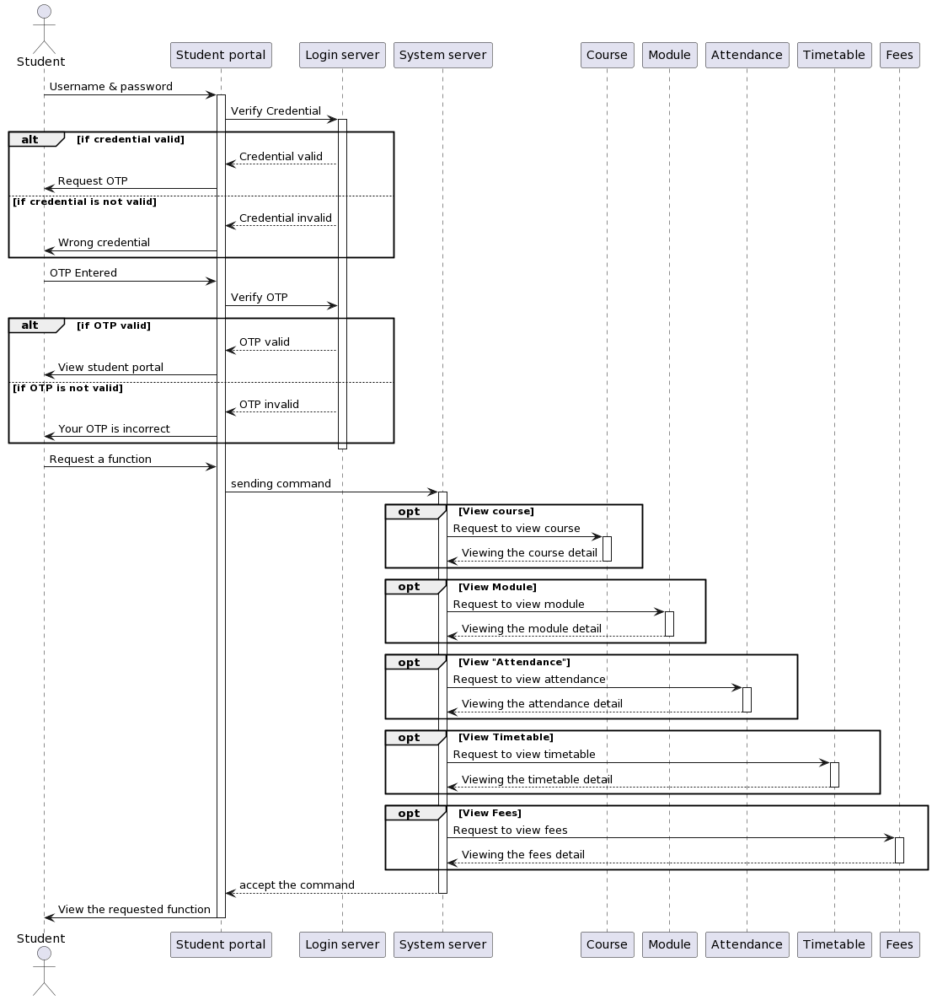

# Phase 2 - Structure modelling and design phase
---

## **2. Table**
---
|Name|Git username|Gre username|Task|
|---|---|---|---|
|Harishanan Thevarjah|Harishanan|ht7998v@gre.ac.uk|Sequence diagram, Class diagram, Gantt chart, Reference|
|Nirmal Philips Tom|nirmalphilips2003|nt1217s@gre.ac.uk|UML case diagram, Overall architecture, Reference|
|Nandana Krishna|nk1121|nk1640r@gre.ac.uk|Introduction, Overall architecture, Activity diagram, Reference|
|Karim Borgi|kb9488|kb3825c@gre.ac.uk| Class diagram, State chart diagram, Reference|  

## **5. Sequence diagram**
---
### **5.1 Sequence diagram structure**
---
The sequence diagram unified modelling language is another type of interaction model diagram. It shows all components/ parts in the system with user interaction. Here, data flows sequentially from one object to another to show the system interactions. Engineers prefer this type of interaction model most in the design phase.  
The sequence diagram mainly has a stick figure, rectangle boxes and arrow lines with a label. They respectively indicate,  
<ul>
    <li> Stick figure : user of the system  
    <li> Rectangle boxes : components/ objects of the system  
    <li>Arrow lines with label : message/ data flow between the objects. (It can be dashed lines to represent any return messages)  
</ul>
This documentation aims to create student management software for an online university. Therefore, a student is considered the user and student management software is regarded as a system. Student management software has several objects in it. They are a student portal, login server and system server containing courses, modules, timetables, attendance and fees objects. Therefore, in the sequence diagram, a student is shown as a stick figure and the student portal, login server, system server and other components are represented with a rectangle.  

Moreover, vertical dashed lines, vertical rectangular boxes and some dotted rectangle boxes with separating dot lines have been used. The vertical dashed lines show the existence of objects and an actor over the time. It is known as a lifeline. Vertical rectangular boxes over them are used to indicate the activation of an object. They are known as activation boxes. The activation box starts from the first interaction message and ends with the last interaction message of the object. The rectangle box with separating dotted lines is used to represent the conditions. It is known as an alternative frame. It can have two or more mutually exclusive conditions in it. Each rectangle will be labeled with the conditions.[3]    

### **5.1 Sequence diagram design**
---
 The diagram shown in appendix figure 3 is the sequence diagram created for the student management software. The diagram's top and bottom sequentially show the actor and objects in the student management system software. This sequence diagram process shows students how to access their module, course, or other needs in the student management software.  

As to the use case,

1.	Students must first login through their own student portal login page. He has to use his valid username and password.  

2.	The student portal will send those credentials to the login server. The login server contains its database and will check whether the credentials are valid.  

3.	The login server can react in two different mutually exclusive ways. Therefore, an alternative frame is used with two separated rectangles. They represent,  

    1. If credentials are valid, it requests a one-time password from the Microsoft authentication app.  
    2. If credentials are invalid, the login server reacts with an error message saying "wrong credentials" through the student portal.  

4.	If credential valid(3.1) happens, the student enters the one-time password in the student portal login page.  

5.	The student portal sends the one-time password again to the login server to verify it.   

6.	Again, another alternative frame shows the results after verification. (This one-time password step happens for an extra layer of security. An unknown person can access a student portal online without the student's permission by finding his username and password. Therefore, this extra layer of protection gives the students an acknowledgment that they are entering their student portal.)  

    1.	If OTP is valid, students can view their student portal home page.  

    2.	If OTP is invalid, the student gets a message saying, "OTP is incorrect." 

7.	If a student gets through the home page, the student can request any function he requires. It can be any operation in his portal, such as wanting to view his course detail or wanting to view his module or timetable.  

8.	The student portal will send the command to the system software.  

9.	If the student asks to view the course, the system server will send a request message to the course object.  

10.	The course object will return the page/details of the course to the system server.  
(Likewise, 9 and 10, It happens to all other objects such as modules, attendance, timetable and fees.)  

11.	The system server will send the accepted command function to 	the student portal.  

12.	The student portal will display the requested function output.  

The above sequence processes are how the student management system works, as shown in the sequence diagram in appendix figure 3.

## **6. Class diagram**
---
Before moving to other behavioural UML diagrams, it's better to start from the class diagram. It gives users accurate illustartions of the system and objects used in student management system. Class diagrams are known as static structural unified modelling language. It describes the structure of the system in more details. Thess details aid a lot in system implementation and testing part(phase 3).

### **6.1 Class diagram structure**
---
A class diagram represents with 3 rectangle boxes. The top rectangle represents the class name, middle rectangle represents the class attributes and the bottom rectangle represents class methods/ operations.  
1. Class diagram is used to represent the components in the student management system software. They are student profile, course, module, timetable, log in, register attendance and fees/ payment. These components are named in the top rectangle which is **class name**.  
2. These components will have same/ specific characteristics. Example student profile class have student id, student first name, student last name, student username, student contact number, student address and student date of birth. These characteristics will be used in the middle rectangle which is **class attributes**. Similar like this each class will have number of attributes. These attributes help to identify the instances in the class.  

3. Class to interact with data a **method** must need. Example student class to get data for its components, it must have operations such as add a student, save student, edit student details, update student details, delete student and search student. These operations will be displayed in the bottom rectangle. 

Moreover, there is an important thing. It is the class association. Every user in the class can’t give access to everything. For example, in a student class student’s first name can be public, but his student id cannot be. It must be protected. Therefore, engineers use different access levels such as public, private, package and protected.  
Public means can be accessed from everywhere. Private means can only be accessed inside the class. Protected means accessed only in the same class and sub-classes of the system. Packaged means accessed only in the class package.

### **6.2 Class diagram design**
---

By getting to know these classes and attributes used here, readers can understand the following behavioural UML diagrams in more details.   

## **9. References**
---
[3] Sien, V.Y., 2011. An investigation of difficulties experienced by students developing unified modelling language (UML) class and sequence diagrams. Computer Science Education, 21(4), pp.317-342. Available at: https://sciresol.s3.us-east-2.amazonaws.com/IJST/Articles/2010/Issue-8/Article20.pdf (Accessed on: 5th January 2023)

## **10. Gantt chart**
---

Gantt chart for phase 2
  

## **11. Appendix**
---  

Figure 3: Sequence diagram for student management system 
  

