# Phase 1 - Requirements Engineering

## **1. Introduction**
---
This markdown sheet describes phase 1 in creating student management system software for an online university. A student management system means that students can participate in educational activities such as attending classes, learning modules and tutorials, monitoring their progress and receiving feedback/results. Due to student management's facilities they are widely used in every educational institution such as schools and universities. The advantages of having a student management system software are students can access studies at any time from anywhere, reduce the workloads of institutions rather than maintaining physical storage and maintenance and improve productivity for lecturers by focusing on only teaching rather than maintaining and securing physical components. Therefore, this student management system is useful for every partipants in the educational institutions such as students, lecturers, insititution's director and more.

## **2. Table**
---
|Name|Git username|Gre username|Task|
|---|---|---|---|
|Harishanan Thevarjah|Harishanan|ht7998v@gre.ac.uk|Introduction, Software process model, User requirements definition, References|
|Nirmal Philips Tom|nirmalphilips2003|nt1217s@gre.ac.uk|Introduction, User requirements definition, Gantt chart, References|
|Nandana Krishna|nk1121|nk1640r@gre.ac.uk|Introduction, Glossary, System requirements specification, References|
|Karim Borgi|kb9488|kb3825c@gre.ac.uk|Introduction, Systems requirements specification, possible risk and risk planning, References|

## **3. Software process model**
---
This is going to be an abstract of our software process to create student management system for the online university. This student management system final version going to produce on 23rd March will fulfill the requirements asked by our clients.

To produce this student management system, our organization is going to use incremental software process model. It is a method of software development where an initial student management system will be designed, will be implemented and tested little by little and produce final student management system fulfilling most of the stakeholder’s requirements.

The reasons are to choose incremental model rather than others are many. In below, some of them have provided.

1.	We are developing a software. There is a chance users/ stakeholders can come and request to change requirements. For examples, online university management can change in future. Therefore, some principles/ requirements can change.
2.	This is the first student management system for the online university is going to use. Therefore, our customers/ stakeholders can’t be sure what they want.
3.	There are some other model such as Waterfall model, it’s hard to go back and change the requirements when needed. It takes more time and money.
4.	Or, if integration and configuration model used, it can be too complex. Asking helps of some various software and components. They can lead to complexity and can’t be able to satisfy other stakeholders all the time. 
5.	In incremental model, it’s easy comparatively with other models. Easily can go back and change. Less time and money. Can satisfy each stakeholders’ needs.
6.	Easier to get customers’/ stakeholders’ feedbacks/ opinions while developing the student management system.
7.	Customer needs this student management system in quick. Therefore, the incremental model can fulfill the requirements in short period by its less numbers of activities in the model.

Figure 1: Incremental model activity structure

Figure 1 shows the workflow structure of our chosen software process model. The circle on the left in figure 1 describes the requirement gathered from our interviews with online university stakeholders. The middle rectangle has 3 software process activities. They are specification, development and validation. Each of them is concurrent activity. In the deeper description of each is,

1.	Specification: Making a formal document from the gathered user and system, functional and non-functional requirements. From that, we software Engineers will develop an initial version of student management system. It will be displayed to the system stakeholders of online university. This can be said as our phase 1.

2.	Development: From the initial version, system stakeholders will request some changes/ developments. They will be reconsidered back. Then, it outputs the intermediate version. It will be displayed to more other stakeholders and to some end users. This can be said our phase 
3.	Validation: Finally with every consideration of intermediate system, the system will be rechecked for last time to see whether it fulfills the customer requirements. Then, the final version of student management system will be implemented in the online university. This can be said our phase 3.

In the above, incremental software model definition, the advantages of the incremental software process model and workflow structures are described. But there is one more responsibility to mention. It is the limitation of the incremental software model. They are frequent incoming new requirements can corrupt the software structure and the development process is not visible. The outcomes of these would lead to more complex and spending and the developed versions’ costs can’t be estimated due to the rapid development. To reduce the effects of our limitations, we software engineers try to get our system and user requirements in completeness and consistent and reduce the imprecision of requirements.

## **5. User requirement Definition**
---

The user requirement definition part classified into 3 parts, first is stakeholder table and requirement, second is specifications of student management system and the requirements and finally with use case diagram of user requirements. [2]

### **5.1 Stakeholder Table**
---

The table below express the stake holders, types and their requirements. This table form under the gathered information from the interview happened with client. 

|Stakeholders|Types|Requirements|
|-----|---|-----|
|Enrolled student|End user| Want to mark attendance, Want to get course and module details, Want to submit course works, Want to get learning resources, Want to check grades.|
|Programme leader|End user|Want to get students course details, Want to check student engagements in the programme, Want to provide programme instructions to students.|
|Module leader|End user|Want to get students’ course details, Want to check student engagements in the module, Want to check course work submissions, Want to provide module instructions to students, Want to upload learning resources.|
|Director|System Owner|Want to get student details including student contacts, Want to know students’ finance details, Can observe overall performance.|
|IT Admin|System Manager|Want to create student's profiles with username, Want to manage student's profiles, Want to fix issues in students’ profiles.|
|New Students|External Stakeholders|Want to check programme details and structure, Want to check fee’s structure, Want to register in a programme.|

Figure 2: Stakeholder interaction 

### **5.2 Facilities of Student Management System**
---

- **5.2.1 Course & Module**
  - Students can view their corresponding course details, information and announcements. (Eg:  students can view announcements related to scheduled classes).
  - Students can access learning resources for each module. (Each module will have its own page) 
  - Module leaders can provide learning resources, detailed information & announcements. (Can upload resources whenever required & can provide announcements about class sections through the module page) 
  - Course leaders can provide resources & instructions. 
  - IT admin will be able to manage issues arising with the course & module page.
  - Newly joining students can view different course options available & can view each course's detailed structure.

- **5.2.2 Coursework, Exams & Results**

  - Module leaders can provide coursework specifications, marking criteria & submission links.
  - Module leaders can conduct online exams.
  - Students can view coursework specifications for each module.
  - Students can view grading criteria & deadlines.
  - Students will be able to submit their coursework through submission links.
  - Students will be able to do online exams in allocated times.
  - Students can view their results when it's published.
  - Module leaders can publish the results in each student account. 
  - Director & Course leader can view each student's performance in coursework & exams. 

- **5.2.3 Attendance Monitoring**
  
  - Students can mark attendance for allocated class sections and can view their overall attendance. 
  - Module leaders can allow students to mark their attendance for each section. 
  - Programme leader and module leader can view student's attendance rate. 
  - Director can view the overall attendance engagement rate in each course.

- **5.2.4 Fees & Funding**
  
  - Students can view their finance page, can view the options available to pay and they can proceed with payment. 
  - Newly joining students can view the fee structure and can view the options available to pay. 
  - Director can view each student's finance details.

- **5.2.5 Student Profiles**
 
  - IT admin can produce only username, student ID and temporary password for newly joining students. 
  - Newly joining students can build their own profile with the username and temporary password provided by IT admin. 
  - Students won't be able to change usernames. 
  - Two-factor authentication is required when signing in. 
  - Students can update their details whenever needed. 
  - Only Director will be able to see personal details. 
  - Students can manage their profile including course and fee details. 
  - Director, course and module leaders will be able to view each student's profile. 
  - Course leaders can see students enrolled in the corresponding course. 
  - IT Admin will be able to manage student profiles and fix the issues related to student accounts. 

- **5.2.6 Timetable**
  
  - Students will be able to see their class and exam timetable as allocated. 
  - Course and module leaders will be able to update or make changes to the timetable. 
  - Director can view the timetable. 

### **5.3 User Case Diagram**
---

In the above topics, stakeholders and facility requirements are detailed. To add more value for the definition of user requirements, below a user case diagram is shown. 

 Figure 3: User case 

In figure 3, according to online university hierarchical position director is the top one. He can view the students’ details, courses and modules details in any needs of any time from the student management system. Then, the IT admin in the university is in charge for the whole student management system. He is the one responsible to create student accounts for the new students and fixing minor issues in the student account. In addition, he can manage the reports created by module and programme leaders. Next is the programme leader, able to provide and alter programme details and can monitor student engagements in the respective programme. He can also view the reports provided by the module leader and can provide report about his programme. Finally, the module leader, able to provide and alter module details and can monitor student engagements in the respective module. He can only provide reports of students in the student management system. 

## **6. System Requirements Specification**

The SRS lists all the system requirements including functional, non-functional, and interface requirements. Typically, SRS is useful for the system developers, possible marketing staff, and testers, system manager and system owner. The customer requires a student management system for an online university where the staff and students can access the student profile, courses and modules, exams, results, timetable, register new students, and monitor the attendance. This online platform shall strengthen institutional legitimacy, improve user satisfaction, and provide information rich virtual campus for both students and faculty.

### **6.1 Functional Requirements**

|Activity|User story|Description|Priority [High=5 Low=1]|
|---|---|---|---|
|Login|An existing user shall be able to login into the system.|The user shall be able to enter the system once their email id and password are entered. They will be able to enter the OTP they have received in their registered mobile number or in the Microsoft authenticator app.|5|
|Reset Password|The user shall be able reset the password.|The user can reset the password by clicking “forgot my password” button. Then the user shall receive an email regarding password reset.|5|
|Course Catalogue|User can access the catalogue of modules.|The user can access a list of the modules and its course id and leader. By clicking any of the desired course, the user shall be directed to the respective module page.|5|
|Modules|The students can access their module details and the faculty can upload any required information in this section.|The faculty can upload any required data like lecture notes, lecture recordings, resources and materials, coursework details, previous year questions and resit information. They shall also be able to provide a link for the coursework submission and a link to enter the virtual classroom.|5|
|Student Records|The students can update their personal information, can access their course details, results, account and can make payment.|The students can update or edit their personal information like mobile number, address, emergency contact details, email address, and bank details. The students can access their course details, mode of study, department and faculty, year of study and their level of study. The students can view their grades and results letter. Students can check their accounts and make online fee transactions by clicking the “Make Payment” button and the user will be directed to an external payment option.|5|
|Timetable and Term Dates|The user can access the class and exam timetable.|The user can access lectures/labs/tutorials/workshops timetable by clicking “My Timetable” button.|5|
|Attendance|Programme leader or course leader can record and view attendance of the students.|the programme leader or the course leader can record the attendance of the students. The students can also view their attendance records.|5|
|Notifications|The user will receive notifications in the notification tab.|The user shall receive notification about their upcoming submissions and events.|5|
|Register new students|New students can access the different courses and register to the university.|New students can access the catalogue of the courses, course content, fees, duration, start month, entry requirements and career opportunity. The students can register to the university by providing necessary previous educational certificates as per the entry requirements. Once the students get their offer from the university, they can confirm their offer and pay the fees. When the student is enrolled, they will receive a personal email id, username, and a temporary password.|5|

### **6.2 Non Functional Requirements**
•	Speed: The system shall not take more than two seconds to load the page or refresh the screen.

•	Usability: The user shall not take more than one hour of training to attain their goals. The users shall not make an average of 2 errors after they complete their training. 

•	Security: Only the user with the role “system owner” can view the students records. The students have access to only their own information, not that of any other participants.Similarly, only the student's email, username, and unique ID are accessible to the programme leader and module leader.

•	Reliability: The user will be able to access any data or visit any links 98% of the time without failure.

•	Availability: In the case of any unanticipated system disruption, all features will be accessible again after one working day.

•	Maintainability: The system shall be down for maintenance approximately three hours in the event of any feature malfunction.

•	Recoverability: If a critical event happens on the system, the company shall take action to resume normal operations as soon as possible—in no more than two days.

•	Data integrity: The system shall maintain data integrity by keeping backups of all data of students and faculty.

•	Localization: The system includes a feature that changes the time zone and currency based on the country the user is in. 

•	Scalability: The system should support at least 1,000,000 simultaneous visits.

•	Performance: The system shall receive any email in not more than 10 seconds to reset the password. The user shall receive an OTP to the registered phone number or the authenticator app in not more than 10 seconds to login into the system. The system will generate a user id and an email id for each student based on the first letters of their names, and a four-digit number will be followed the two letters. 

## **7. Risk management and Identification**
---
### **7.1 Introduction**
For every software developmenet project, There are many risks that could implement the software's quality and the timeframe in which the software would be ready. There are too many risks which can inpact the software, and they are divided into 3 categories:  
* Bussiness Risks
* Project Risks 
* Product Risk

We have hghlighted some of the risks that are most likely to happen and we have arranged them according to the type of risk.   
   
The 2 tables below will dive into each type of risks and investigate ways we have decided to identify these risks, analyse them, plan for ways to avoid these risks to happen, and monitor the progress. For these tables the **threat** level is divided into **3** severities which are **low, moderate, and high** with the **Probability** level divided into **low, medium and high**. These 2 were then studied to extract a risk level which is divided into **3** colors with increasing level of risk with each color:  
* **Green**
* **Amber**
* **Red**

 These probabilities were extracted after hours of research into competitors and studying relevant aspects of our team.

### **7.2. Business Risks**
---
  

The table above identifies the business risks that are most likely to happen throughout the project development, with the most probable being technology changes and teammate inexperience. However teammate inexperience is the only high probability risk that has a high severity level as after conducting a servery between ourselves we found out that we are lacking in c# skills, so we have decided to allocate some of our free time into developing these skills as well as any inadequacy that would come to light at a later date. Poor staff cohesion as well as low stakeholder engagement have also been identified as high severity threats but we believe that they do not have a high probability of occurring, though it is imperative that we constantly monitor them, especially low stakeholder engagement as we found that it might cause alarming problems as software developement goes on. Thus the only 2 alarming risks are teammate inexperience and low stakeholder engagement.  
 
### **7.3. Product and Project Risk**
---
 

The table above shows the highlighted project and product risks that are the most likely to affect our project. The risks that are most likely to happen are frequent requirement changes requested by client, low estimation of time needed to finish certain tasks as well as hardware unavailability, with the only high probability risk of severe threat being the former, since due to the fact of staff inexperience it might be hard to implement big changes, that’s why we have decided to implement an incremental software development process model to make it easier to make changes in code structure and features. Hardware unavailability is another high threat risk as without the hardware, which is mainly the laboratory desktops that we are using, nothing can be achieved. That is why it is recommended that all team members download relevant software on their personal laptops so they can work from it. Both combined metrics combined to show that the most threatening of project and product risks are all identified risks with a high probability of occuring so it is advised to constantly check these risks using the moniitoring methods mentioned on the table.  

## **8. Reference**
---
[1] C. Larman and V. R. Basili, "Iterative and incremental developments. a brief history," in Computer, vol. 36, no. 6, pp. 47-56, June 2003. Available at: https://ieeexplore.ieee.org/document/1204375 (Accessed on: 27th November 2022)

[2] Maiden, N., 2008. User requirements and system requirements. IEEE Software, 25(2), pp.90-91. Available on: https://ieeexplore.ieee.org/abstract/document/4455639/authors#authors (Accessed on:1st December 2022)

[4] Shahzad, B., Ullah, I. and Khan, N., 2009, December. Software risk identification and mitigation in incremental model. In 2009 International Conference on Information and Multimedia Technology (pp. 366-370). IEEE. Available at:https://ieeexplore.ieee.org/abstract/document/5381181 (Accessed on: 30th November 2022)

## **9. Gantt chart**
---

